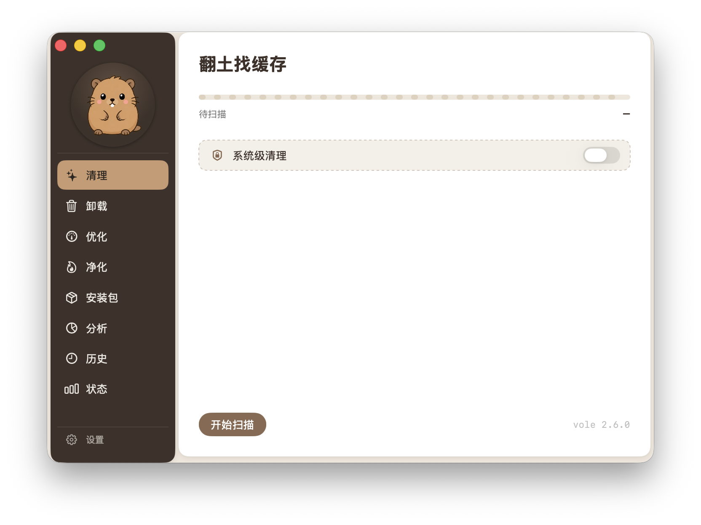
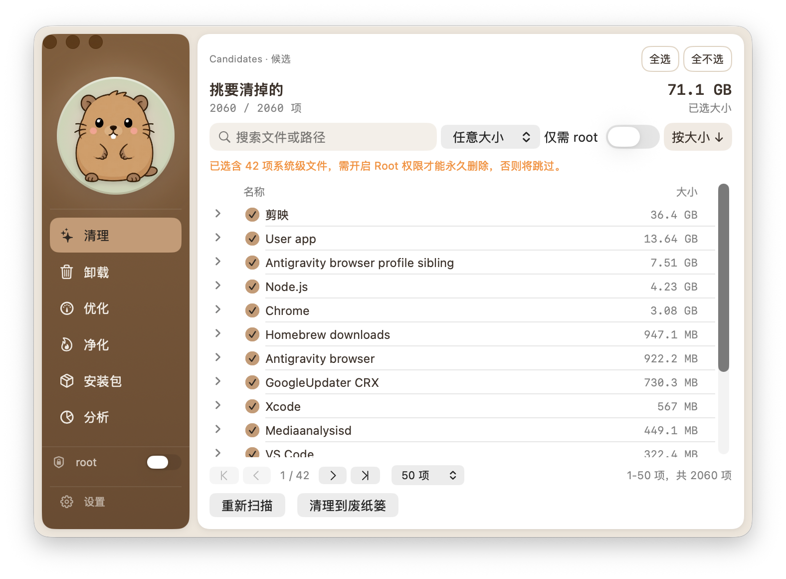

<div align="center">


# Vole for macOS

**Mac용 정리 앱**  
먼저 확인 · 기본은 휴지통 · 용량 잡는 찌꺼기를 한눈에

[](LICENSE)
[](https://github.com/wukongnotnull/vole-macos/releases)
[](https://github.com/wukongnotnull/vole-macos)
[](https://github.com/wukongnotnull/vole-macos/releases/latest)
[](https://github.com/wukongnotnull/vole-macos/stargazers)

</div>

**언어:** [English](README.md) · [简体中文](README.zh-CN.md) · [繁體中文](README.zh-TW.md) · [日本語](README.ja.md) · [한국어](README.ko.md)

> 캐시, 로그, 삭제 잔여물, 설치 파일, 빌드 찌꺼기… Vole이 찾아 주고, **선택한 것만 삭제**합니다. 기본은 휴지통이라 잘못 지워도 복구할 수 있습니다.

---

**바로가기**
[화면 미리보기](#화면-미리보기) · [할 수 있는 일](#할-수-있는-일) · [다운로드·설치](#다운로드설치) · [처음 사용](#처음-사용) · [안전](#안전) · [FAQ](#faq) · [CLI](#명령줄을-선호한다면) · [소개](#소개) · [감사의-말](#감사의-말) · [라이선스](#라이선스)

---

## 화면 미리보기

<p align="center">
  
  
</p>

---

## 할 수 있는 일

| 기능 | 얻는 것 |
|------|-------------|
| **정리** | 캐시·로그·잔여 데이터를 찾아 선택한 항목만 정리 |
| **제거** | 앱을 지우고 사용자 영역 잔여물도 최대한 제거 |
| **최적화** | 캐시 재구성 등 범위가 정해진 시스템 유지보수 작업 실행 |
| **정화** | 오래된 프로젝트 빌드 산출물 등 큰 용량 항목 정리 |
| **설치 파일** | 디스크에 남은 `.dmg` / `.pkg` 등 찾기 |
| **분석** | 어떤 폴더·큰 파일이 공간을 쓰는지 확인 |
| **기록** | 과거 정리·삭제 내역 확인 |
| **상태** | 건강 점수·CPU·메모리·디스크를 한눈에 |

GUI로 Mac을 정리하고 싶지만 “한 번에 전부 삭제” 후 후회하고 싶지 않은 분께 맞습니다.

---

## 다운로드·설치

1. [최신 Release](https://github.com/wukongnotnull/vole-macos/releases/latest) 열기
2. **`Vole-*.dmg`** 다운로드 (`.zip`도 제공)
3. DMG를 열고 **Vole**을 응용 프로그램으로 드래그
4. Launchpad 또는 응용 프로그램에서 실행

현재 버전: **[v0.1.0](https://github.com/wukongnotnull/vole-macos/releases/tag/v0.1.0)** (Developer ID 서명 및 Apple 공증).

“확인되지 않은 개발자” 경고가 나오면 **시스템 설정 → 개인정보 보호 및 보안**에서 허용하거나, 앱을 우클릭 → 열기.

---

## 처음 사용

더 완전한 정리를 위해 다음 두 단계를 권장합니다.

### 1. 「전체 디스크 접근」 켜기

권한이 없으면 많은 사용자 폴더를 충분히 스캔하지 못해 결과가 적어 보입니다.

1. **시스템 설정 → 개인정보 보호 및 보안 → 전체 디스크 접근** 열기
2. 켜고 **Vole** 체크

### 2. (선택) Root 권한 도우미 사용

일부 **시스템 경로**를 정리할 때만 필요합니다. 개인 파일만이면 없어도 됩니다.

1. 홈 화면에서 **「Root 권한 도우미 사용」** 탭
2. 시스템 설정에서 백그라운드 항목 승인
3. 상태가 「사용 중」이면 완료

사용하지 않으면 시스템 경로는 **건너뛰고 명확히 안내**하며, 삭제된 것처럼 속이지 않습니다.

---

## 안전

```
당신      ❯ 「정리」→ 스캔 → 지울 항목 선택 → 확인

Vole      ❯ ✓ 후보를 먼저 보여 주고 바로 지우지 않음
            ✓ 기본은 휴지통(복구 가능)
            ✓ 시스템 경로는 권한 도우미 경유; 미승인이면 건너뜀
            ✓ 화이트리스트 밖 위험 경로는 삭제하지 않음
```

| 원칙 | 의미 |
|------|------|
| **미리 보고 실행** | 항상 후보를 보고 선택한 뒤 삭제 |
| **기본은 복구 가능** | 개인 파일은 휴지통으로 (즉시 완전 삭제 아님) |
| **권한 없으면 건너뜀** | Root 도우미가 없으면 시스템 경로를 건너뛰고 설명 |
| **추적 가능** | 「기록」에서 무엇을 했는지 확인 |

---

## FAQ

**Q: 스캔 결과가 너무 적은가요?**  
A: **시스템 설정 → 개인정보 보호 및 보안 → 전체 디스크 접근**에서 **Vole**을 허용한 뒤 다시 스캔하세요.

**Q: 시스템 경로를 건너뛰었다고 나오나요?**  
A: 정상입니다. 홈에서 Root 권한 도우미를 켜고 시스템 설정에서 백그라운드 항목을 승인하세요.

**Q: 잘못 지웠어요.**  
A: 기본은 휴지통입니다. 휴지통에서 복구하면 됩니다. 완전 삭제를 선택했다면 휴지통으로는 되돌릴 수 없습니다.

**Q: 파일을 인터넷으로 보내나요?**  
A: 일상 정리는 로컬에서만 이뤄집니다. 자동 업데이트 등 네트워크 기능은 설정에서 명시적으로 쓸 때만 동작하며, 백그라운드로 파일을 업로드하지 않습니다.

**Q: Mole과 어떤 관계인가요?**  
A: 정리 규칙과 안전 아이디어는 [Mole](https://github.com/tw93/Mole)에서 영감을 받았습니다. Vole은 독립 오픈소스이며 Mole에 소속되지 않습니다.

---

## 명령줄을 선호한다면?

같은 엔진의 CLI도 있습니다: [vole](https://github.com/wukongnotnull/vole).

```bash
brew tap wukongnotnull/vole https://github.com/wukongnotnull/vole
brew install vole
```

데스크톱과 CLI는 같은 정리 엔진·안전 모델을 공유합니다.

---

## 소개

**悟空非空也 (Wukong)** — AI之道 창립자, 인디 개발자, 크리에이터.

| 플랫폼 | 링크 |
|------|------|
| 🌐 웹사이트 | [waytoai.cn](https://waytoai.cn) |
| 𝕏 Twitter | [悟空非空也](https://x.com/wukongnotnull) |
| 📺 Bilibili | [悟空非空也](https://space.bilibili.com/456634391) |
| ▶️ YouTube | [悟空非空也](https://www.youtube.com/@wukongnotnull) |
| 📕 샤오홍슈 | [悟空非空也](https://www.xiaohongshu.com/user/profile/5ca89c2f000000001100952b) |
| 💬 WeChat | 「悟空非空也」검색 |

---

## 감사의 말

macOS 정리 UX를 개척한 제품·오픈소스에 감사드립니다. Vole이 많은 것을 배웠습니다:

- [Mole](https://github.com/tw93/Mole) — 오픈소스 클리너. 규칙·안전의 주요 영감
- [CleanMyMac](https://macpaw.com/cleanmymac) — 세련된 데스크톱 정리 UX 참고
- [Tencent Lemon](https://lemon.qq.com/) — 중국어권에 익숙한 시스템 클리너 참고

Vole은 독립 오픈소스이며 위 제품과 소속·상업 관계가 없습니다.

---

## 라이선스

Vole for macOS는 [GPL-3.0](LICENSE)입니다.  
자체 제품으로 파생할 경우 혼동을 피하도록 이름을 바꾸고, Mole / Vole을 출처로 밝혀 주세요.

---

<div align="center">

GPL-3.0 license © [悟空非空也](https://github.com/wukongnotnull)

</div>
